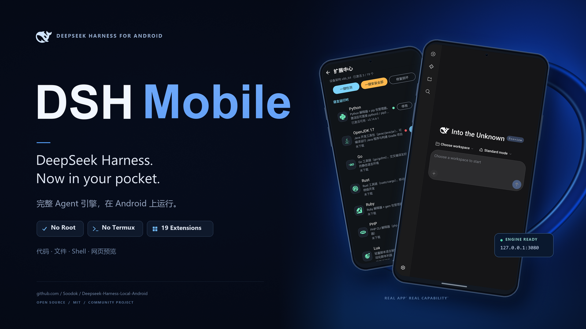

# DSH Mobile （Deepseek-harness-Mobile)

<p align="center">
  
</p>

**DeepSeek Harness 的 Android 完整移植 —— 官方 dsh 引擎原样跑在手机沙箱里，无需 Root、无需 Termux、无需电脑。**

> 🌐 [English](README_EN.md) · [Deutsch](README.de.md)

[](https://github.com/Soodok/Deepseek-Harness-Local-Android/actions/workflows/android-build.yml)


[中文](#简介) · [English](README_EN.md)

---

## 简介

DSH Mobile 是 [DeepSeek Harness](https://github.com/deepseek-ai/deepseek-harness)（DeepSeek 开源的 Agent 框架）的 **Android 完整移植**。完整的 Node.js Agent 引擎运行在应用沙箱内，监听 `127.0.0.1` 回环——会话、凭证、工作区**全部留在手机上**，装完即用，数据不出设备。

**这是**：官方 dsh 引擎（锁定 `0.2.0-rc.2`）+ 自建 Android 运行环境。插件体系、WebUI、工具调用链全部来自上游，本项目负责运行层：bionic 版 Node.js 运行时、前台服务保活、三级权限、扩展中心。**桌面上 dsh 能做的事，这里都能做。**

**这不是**：不是自研 Agent 框架，不是端侧大模型 App（模型走你配置的 API），不是手机自动化 Agent（读屏点击是交给 AI 的工具之一）。

## ⚡ 性能实测

| 指标 | 实测值 | 环境 |
|---|---|---|
| **冷启动到引擎就绪** | **< 10 秒** | 一加 15T（Android 16）真机 |
| **多服务并行内存** | **< 400 MB** | 引擎 + 多工具链同时运行 |
| **兼容版本** | **Android 8.0 → 16** | 需 WebView ≥ Chrome 85 |
| **APK 体积** | **124 MB** | 含完整 Node.js 运行时 + 19 项扩展的工具链闭包 |
| **安装后占用** | **约 490 MB** | 运行时解压后（SONAME 别名用符号链接，省 90MB） |

对比：Termux 快照类方案首次启动通常需**数分钟**（解压 + 手动初始化）；本项目的运行时预置在 APK 内，装完即用。proot 系方案（Ubuntu 容器）APK 看着小，但首次使用要另下 500MB～2GB 的 rootfs。

## ✨ 核心能力

### 🔌 扩展中心：19 项环境一键装

内置扩展中心提供 **Python、Go、Rust、Clang、OpenJDK、Git、Ruby、PHP、Perl、Lua、SQLite、FFmpeg、ImageMagick、OpenSSH、ADB、Vim** 等 19 项环境扩展，一键下载、红/黄/绿三态管理、行内进度条实时可见。

- 国内镜像直连（清华 TUNA → 中科大 → 北外 → Termux 官方自动切换）
- 依赖闭包自动解析、SHA-256 强校验、原子发布
- 装完即补 shebang 解释器链（`env python3` 类脚本不依赖 PATH 也能跑）
- 每行带 **⟳ 一键重装**（覆盖式重下，修复历史残缺安装）
- 19 项扩展的 bin 依赖经 `scripts/audit-extension-closures.py` **ELF 级审计**

**Agent 自我扩展**：AI 不只会用扩展中心，还会在会话里通过本地接口自主安装环境并自动激活；Root 模式下已实测成功自装 Android SDK 命令行工具。

### 🖥️ 完整 Agent 任务执行

派任务给 Agent：读写文件、执行 shell 命令、全文检索、管理项目——bionic bash / ripgrep / pnpm / curl 随包内置，依赖闭包经 ELF 校验，是真实执行力，不是只能聊天的壳。

**即时预览成果**：Agent 起本地 HTTP 服务，给你 `http://127.0.0.1:端口` 链接，点开即预览（小游戏、静态站、API 服务均已实测），一键回主页。

### 💾 数据不随卸载消失

会话、配置、工作区放在**内部存储 `Documents/dshdata`** —— 文件管理器里可见、可复制、可备份，**卸载重装数据不丢**。

- 老版本升级：私有目录里的数据**自动迁移**过去（复制 → 核对条目数 → 删旧，失败则保留原数据）
- 公开目录不可用（如权限受限）时自动回退私有目录，功能不受影响（自检会提示当前状态）

### 🔗 远程终端与文件传输（SSH）

装上 **OpenSSH 扩展**后，可从电脑用 SSH 连上手机里的环境：终端操作、`scp` / `sftp` 传文件、跑长任务。配合 Shizuku/Root 模式，远程也能用 Agent 的设备能力。

> ⚠️ **dsh 的 WebUI 本身不支持局域网访问** —— 这是上游的安全设计：dsh 源码里明确拒绝绑定 `0.0.0.0`（"would expose remote code execution to the network"），且前端在非 localhost 环境会因 `crypto.randomUUID` 不可用、`isLoopbackHostname` 判定为假而失去设置类功能。**电脑浏览器无法直接打开手机上的 WebUI**；需要图形界面请在手机上看，或用 SSH 做终端操作。

### 🎙️ 语音输入

点悬浮球麦克风弹出底部输入面板，识别结果实时上屏、可手改后一键发送直达当前对话。发送链路全部由 Android 侧时序驱动，**App 退到后台照样即时发出**；对 WebUI 富文本输入框的写入走编辑器原生 paste 管线并回读校验，不会内容重复。

设备没有识别服务时，可安装我们的开源离线识别插件 [dsh-asr-service](https://github.com/Soodok/dsh-asr-service)（模型走国内镜像，下载源跟随系统语言）。

### 📜 流式悬浮条

AI 输出**贴屏幕顶部实时滚动**，不用切回 App 就能看到它在说什么、在调什么工具：

- 主行：AI 当前输出（流式刷新）
- 下方：最近工具调用（`bash · npm test` / `edit · src/app.ts` 这类可读形式，最多 3 条）
- **点击展开**看更多行，**长按隐藏**；无内容时自动淡出
- 数据源是引擎的会话事件流（`assistant-stream` / `tool/call` / `turn/end`）

### 🫧 悬浮窗 · 保活 · 无障碍

- **悬浮窗**：可拖动状态球随引擎状态变色，展开显示 AI 最近一次动作与时间
- **保活**：无障碍服务看门狗自动拉起被系统回收的引擎；WebView 后台保持定时器，语音消息即时得到响应
- **操作手机屏幕（非盲）**：读屏（文本 + 坐标）并按文本/坐标精准点击，支持断点断言与重试、目标丢失找回、歧义告警、滚动定位，每步自动截图

### 🛡️ 设备能力与安全边界

Agent 通过本机桥（`127.0.0.1:3083`）操作手机，**全部能力 token 门控**：

- **读屏 / 点击 / 输入 / 滑动 / 按键 / 截屏**：无障碍服务实现，无需 ADB
- **通知 / 震动 / TTS 朗读**：Agent 可主动叫醒你
- **进程管理**（`psx` / `killx`）：按进程名匹配，二进制安全
- **桥鉴权**：token 每次启动随机生成、只注入引擎环境，**同设备第三方 App 无法调用**（实测无 token 返回 `unauthorised`）
- **su 闸门**：普通模式下 `engine/bin` 位于 PATH 首位，拦截 AI 子进程提权

### 🔐 三级权限

| | 普通 | Shizuku | Root |
|---|---|---|---|
| 引擎身份 | 应用沙箱 | 应用沙箱 | uid 0 全盘 |
| Agent 能力 | 沙箱内命令 | + adb 级命令（`shz`） | 全盘读写 |
| 前置条件 | 无 | 安装并启动 [Shizuku](https://shizuku.rikka.app/) | 设备已 Root |
| 安全机制 | su 闸门拦截提权 | su 闸门拦截提权 | 双重高危确认 + 启动前自动备份 |

默认普通模式；能力未就绪的选项自动置灰；切换后引擎自动重启生效。

### 🧪 实验性功能

设置 → 其他 → **实验性功能**（默认关闭）。开启后显示悬浮窗、麦克风权限、语音服务、本地识别应用等入口。

## 🌟 这些是 Termux 路线给不了的

**插件体系开箱可用，不用先当一次编译工程师**
dsh 的「一切皆插件」架构原样保留：插件热载、会话持久化全部照常工作。插件缺的语言环境由扩展中心一键补齐。Termux 路线上，`sharp` / `koffi` / `node-pty` 这类原生模块编译失败是常态。

**跨版本兼容，逐台设备踩过的坑已经踩完**
App 支持 Android 8.0 → 16；界面渲染依赖系统 WebView（**需 Chrome 85+**），构建时向前端注入 polyfill（覆盖 13 个现代 API），把 API 层门槛从原生 Chrome 126 拉回到 85；全部 so 按 **16KB 页对齐**，新内核设备直接可用。

**后台不被杀，任务完成有通知**
specialUse 前台服务 + 指数退避监督器扛住系统回收，长任务锁屏/后台持续运行，完成自动发系统通知。

## 🆚 Android 上跑 Agent 的几条路线

| | Termux 手动配置 | proot + Ubuntu | APK 快照打包 | **DSH Mobile** |
|---|---|---|---|---|
| 安装体验 | 装 Termux、配环境、装依赖 | 装容器与发行版 | 装即用 | **装即用** |
| 首次可用需下载 | 手动配置 | rootfs 500MB～2GB | 无 | **无** |
| 运行时 | 活环境（可扩展） | 容器内 glibc | 死快照，随包冻结 | **自建 bionic 闭包，CI 收集校验** |
| 许可证合规 | — | — | ⚠️ 快照打包 GPL 组件，合规存疑 | **仅含 MIT/BSD/ISC/Zlib 组件** |
| 权限分级 | 无 | 无 | 无 | **三级模式 + su 闸门 + Shizuku adb 桥** |
| 环境扩展 | 手动装 | apt | 死快照，不可扩展 | **19 项一键装 + AI 自助安装** |
| Termux 依赖 | 需要 Termux App | 需要 | 快照即 Termux | **零依赖**（硬编码路径已重定位） |

> 路线之间不是替代关系：Termux 系是在 Android 上**搭一个 Linux 环境**再跑 dsh；本项目把 dsh 需要的运行时**打进 APK**。**两条路线跑的是同一个 dsh**。
>
> 📄 完整路线剖析见 **[docs/android-agent-routes.zh.md](docs/android-agent-routes.zh.md)**（[English](docs/android-agent-routes.md)）。

## 📦 安装

**下载 Release（推荐）**：前往 [Releases](https://github.com/Soodok/Deepseek-Harness-Local-Android/releases) 下载 APK（手机选 `arm64-v8a`，最新版 **v1.2.98**），允许安装未知来源应用后安装。

> 📦 **Release 里有多种包，怎么选**：普通用户下 **`dsh-mobile-*-arm64-v8a.apk`**（正式签名）；
> 文件名带 **`-debug`** 的是调试签名版，供抓日志调试、或之前就装 debug 渠道的用户继续升级用；
> 带 `x86_64` 的仅用于模拟器。**正式版与调试版签名不同、无法互相覆盖安装**（会提示「应用签名不一致」），装错需先卸载。

**从源码构建**（JDK 17 + Android SDK，NDK r26+、CMake 3.22.1）：

```bash
./scripts/collect-termux-runtime.sh app/src/main/assets/runtime.zip aarch64
python scripts/dedupe-runtime.py app/src/main/assets/runtime.zip   # 别名去重，省 ~33MB
gradle assembleDebug -Pabi=arm64-v8a
```

或 Fork 后在 GitHub Actions 运行 **android-build** 工作流云端出包。

**系统要求**：Android 8.0+（**WebView ≥ Chrome 85**）· arm64-v8a / x86_64 · **建议预留 700MB 以上空间**。

## 🚀 快速上手

1. 首启选择显示方向与权限模式（不确定就选「普通」）
2. 等待运行时解压（真实进度）与引擎启动
3. 进入对话派任务；齿轮图标进设置；点击 Agent 给的 `127.0.0.1` 链接预览成果
4. 语音输入、悬浮窗等入口在设置 → 其他 → **实验性功能**开关之后（默认关闭）

## ⛔ 边界（请知悉）

- **WebView 需 Chrome 85+**：引擎前端用了 `??=` 等新语法，属解析期特性，polyfill 补不了。Android 8.0+ 的 WebView 是可独立升级的系统组件，升到 85+ 即可；少数无法升级的老机型为已知限制
- **没有桌面环境**：不能运行 Linux GUI 桌面应用；视觉产物通过本地 HTTP + 内置 WebView 预览
- **模拟点击是"半盲"的**：读屏基于无障碍节点树，对纯图形/游戏画面无效
- **长任务非绝对不死**：用户强杀/极端省电模式仍会中断（引擎会自动重启，进行中任务需重新派发）
- **提权伴随风险**：Root 模式 AI 具全盘读写能力，误操作可能损坏系统——详见下方免责声明

## ❓ FAQ

**需要 Root 吗？** 不需要。普通模式覆盖绝大多数用法，Root/Shizuku 是高级可选项。

**和 Termux 方案是什么关系？** 并列关系。Termux 路线是在 Android 上搭一个 Linux 环境再跑 dsh；本项目把运行时打进 APK，装完直接用。**两边跑的是同一个 dsh**。

**它是自己实现了一套 Agent 吗？** 不是。Agent 逻辑、插件体系、WebUI 全部来自官方 [`@deepseek-ai/dsh`](https://github.com/deepseek-ai/deepseek-harness)；本项目只做 Android 侧运行环境。这也是它被称作「**移植**」而不是「框架」的原因。

**数据会上传吗？** 引擎/会话/工作区全在本机；数据是否出设备取决于你配置的模型服务地址。

**APK 为什么有 124MB？** 内置了完整的 Node.js bionic 运行时、Termux 工具链闭包（bash / ripgrep / 各 SONAME 库）以及 dsh 的整棵依赖树（79 个包）。这是「不依赖 Termux、装完即用」的代价。Termux 系方案把这部分留给用户自行安装，所以包体小，但首次使用要花数分钟配置。

**Agent 怎么展示网页？** 让它起本地 HTTP 服务并给你 `http://127.0.0.1:端口` 链接，点开即预览。

**无障碍点不进去？** Android 要求无障碍服务必须在系统设置中手动开启，应用内按钮只负责跳转。

## ⚠️ 免责声明

> **请在使用前仔细阅读本节。**

1. 本软件按「现状」提供，不附带任何明示或默示的担保。作者不对因使用、滥用或无法使用本软件导致的任何直接或间接损失承担责任。
2. **Root 模式下，引擎以最高权限（uid 0）运行，AI 生成的命令具备对整台设备的完全读写能力。** AI 可能产生错误、意外或破坏性的操作——包括但不限于删除系统文件、破坏分区、导致设备无法启动。**由此造成的任何设备损坏、数据丢失、保修失效，均由用户自行承担全部责任，与作者无关。**
3. Shizuku 模式下 Agent 可执行 adb 级操作，同样存在误操作风险，请知悉并自行斟酌。
4. 请仅在**你本人拥有或获得明确授权**的设备上使用本软件；将其用于未授权设备或非法用途的后果由使用者自行承担。
5. Root/Shizuku 模式均为可选项，不开启则 Agent 被严格限制在应用沙箱内。**如果你不想承担任何风险，请保持普通模式。**

**继续安装或开启高权限模式，即视为你已阅读、理解并接受上述全部条款。**

## 反馈

遇到问题或功能建议，欢迎提交 [Issue](https://github.com/Soodok/Deepseek-Harness-Local-Android/issues)；崩溃类问题请附上 `logcat` 输出或应用内的引擎日志。

## 许可证

[MIT](LICENSE)。运行时组件沿用其原始许可证（MIT / BSD / ISC / Zlib）；`@deepseek-ai/dsh` 归 DeepSeek AI 所有。

本项目为独立社区作品，与 DeepSeek 无隶属关系。
